---

Looking for Matt & John's® 10 000 punks collection (Anno 2017)?
See [**Punks - The Free White Label Quick Starter Edition »**](https://github.com/cryptopunksnotdead/punks.whitelabel)


---


New to Ordinal Punks? For some background see [**Awesome 100 Ordinal Punks (Anno 2023) Notes - 24×24 Pixel Art on the (Bitcoin) Blockchain »**](https://github.com/ordinalpunks/awesome-ordinalpunks)


# 100 Ordinal Punks - The Free White Label Quick Starter Edition

Yes, you can. Let's (re)create from zero / scratch a pixel-perfect
copy of the Ordinal Punks collection (Anno 2023) using text prompts ("attributes").


---

Note / Disclaimer:  I (Gerald Bauer) am the creator of the punk's not dead text-to-image generation algorithm  (& [punk spritesheet](https://github.com/openpunkart/punks.spritesheet)) BUT
have heard about Ordinal Punks in the news and
I have no insight knowledge and
I am NOT affiliated with Ordinal Punks (HODLing: 0).


**Update**  Since getting attacked (repeatedly) by "More Punks" the Ordinal Punks founder "Flow Stay" has reached out to my call for help
and "unlocked / verified" my Ordinal Punks discord (chat server) membership where I now post in the #general or #pixelart-programming channels (from time-to-time).

---


Let's get the official metadata (text-prompt attributes)
from [Inscription @ #58665](https://ordinals.com/inscription/d026ac5994f698dba475681359b6c29d6d39a895484b95e06b7ae49921d80df2i0) uploaded by [Tropo Farmer](https://twitter.com/tropoFarmer/status/1624528735700385792) (on February 11th, 2023).


Triva / Errata:   While preparing this step-by-step guide / tutorial
I found two bugs / errors in the official metadata:

- 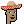 Ordinal Punk #25  - Incl. An Extra Hoodie
    >     "attributes": [{"trait_type": "Type",   "value": "Male 2"},
    >                    {"trait_type": "Hair",   "value": "Sombrero"},
    >                    {"trait_type": "Mouth",  "value": "Mustache"},
    >                    {"trait_type": "Clothes","value": "Hoodie"}]
- 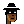 Ordinal Punk #84  - The (Punk) Type Reads:  Alien Male Green BUT is really (Human) Male 1
    >     "attributes": [{"trait_type": "Type", "value": "Male Alien Green"},
    >                    {"trait_type": "Eyes", "value": "Eye Mask"},
    >                    {"trait_type": "Mouth","value": "Chinstrap"},
    >                    {"trait_type": "Hair", "value": "Fedora Black & White"}]


Note: On March 25th, 2023 - I assume - "Flow Stay" uploaded a fixed version of the official metadata (text-prompt attributes). See [Inscription @ #592145](https://ordinals.com/inscription/a64027dabba3c5acf83068028edf4e938464ff3c6b279f0415f5c6573cf03207i0)
that now reads:

-  Ordinal Punk #25
    >     "attributes": [{"trait_type": "Type",   "value": "Male 2"},
    >                    {"trait_type": "Hair",   "value": "Sombrero"},
    >                    {"trait_type": "Mouth",  "value": "Mustache"}]
-  Ordinal Punk #84
    >     "attributes": [{"trait_type": "Type", "value": "Male 1"},
    >                    {"trait_type": "Eyes", "value": "Eye Mask"},
    >                    {"trait_type": "Mouth","value": "Chinstrap"},
    >                    {"trait_type": "Hair", "value": "Fedora Black & White"}]


**Update**  Since getting "unlocked / verified" on the Ordinal Punks discord (chat server) and now with full (read) access I can
report that "Flow Stay" has posted all metadata (text-prompt) attributes
in the #trait-list channel (on February 8th, 2023)


```
Letting everyone know the traits before json metadata file goes out:

  1: ["Male Robot", "Big Beard"]
  2: ["Male2", "Birthday Hat", "Bubble Gum"]
  3: ["Female1", "Flowers", "Frown", "Gold Chain"]
  4: ["Male Demon", "Hoodie", "Pipe"]
  5: ["Male Blue Ape", "Buck Teeth", "Cowboy Hat"]
  6: ["Male3", "Laser Eyes", "Cowboy Hat Black & White"]
  7: ["Male1", "Burger King Cap"]
  8: ["Male Vampire", "Demon Horns"]
  9: ["Orange Female", "Crown"]
 10: ["Female3", "Choker", "Wild White Hair", "Cigarette", "Mole", "Big Shades", "Frown"]
 11: ["Male Zombie", "Mole", "3D Glasses", "Frown", "Big Beard", "Earring"]
 12: ["Male Orc", "Beanie", "VR", "Clown Nose"]
 13: ["Female4", "Pilot Helmet", "Silver Chain", "Clown Eyes Green"]
 14: ["Male Orange", "Beanie Black & White"]
 15: ["Male4", "Police Cap Black & White", "Regular Shades"]
 16: ["Male4", "3D Glasses Black & White"]
 17: ["Male Demon", "Cigarette", "Laser Eyes"]
 18: ["Male4", "Buck Teeth", "Cigarette", "Frown", "Gold Chain", "Knitted Cap", "Earring", "Mole"]
 19: ["Female1", "Bow"]
 20: ["Male Zombie Ape", "Cigar", "Bubble Gum"]
 21: ["Male Gold Alien", "Top Hat Black & White", "Silver Chain"]
 22: ["Male Blue", "Clown Hair Blue"]
 23: ["Female2", "Rosy Cheeks", "Tiara", "Smile"]
 24: ["Male1", "Medical Mask", "Clown Nose", "Hoodie"]
 25: ["Male2", "Sombrero", "Mustache"]
 26: ["Male Vampire", "Bubble Gum", "Spots", "Do Rag"]
 27: ["Male Mummy", "Beanie"]
 28: ["Male2", "Crazy Hair", "Regular Shades", "Cigar"]
 29: ["Male Zombie", "Hoodie", "Gold Chain", "VR"]
 30: ["Male2", "Jester Hat"]
 31: ["Male1", "Red Cap"]
 32: ["Male4", "Laser Eyes", "Messy Hair"]
 33: ["Female2", "Hoodie", "Eye Patch"]
 34: ["Female3", "Black Lipstick", "Choker", "Eye Mask"]
 35: ["Male Skeleton", "Eye Patch", "Fedora"]
 36: ["Female4", "Clown Hair Green", "Classic Shades"]
 37: ["Male1", "3D Glasses", "Cigarette", "Buck Teeth"]
 38: ["Female Orc", "Blonde Bob"]
 39: ["Female Zombie", "Birthday Hat", "VR"]
 40: ["Male2", "Laser Eyes", "Bandana"]
 41: ["Female Mummy", "Crown"]
 42: ["Female Demon", "Cigar", "Choker"]
 43: ["Female4", "Nerd Glasses", "Frumpy Hair"]
 44: ["Female1", "Cowboy Hat", "Pipe"]
 45: ["Male2", "Top Hat", "Silver Chain", "Smile"]
 46: ["Blue Male", "Burger King Cap", "Classic Shades"]
 47: ["Purple Female", "Clown Eyes Green", "Blonde Bob"]
 48: ["Gold Male", "Laser Eyes", "Frown", "Cap Forward"]
 49: ["Female3", "Beanie", "Blue Eyeshadow", "Earring"]
 50: ["Male Alien Ape", "Goat", "Fedora"]
 51: ["Blue Female", "Nerd Glasses", "Blonde Short"]
 52: ["Female Pink Alien", "3D Glasses"]
 53: ["Female Demon", "Frumpy Hair", "Clown Nose"]
 54: ["Male3", "Heart Shades", "Do Rag"]
 55: ["Female Skeleton", "Bandana", "Cigarette"]
 56: ["Female2", "Earring", "Mole", "Cap", "Smile"]
 57: ["Male4", "Clown Nose", "Top Hat Black & White"]
 58: ["Female Vampire", "Heart Shades"]
 59: ["Blue Male", "Cowboy Hat Black & White", "Pipe", "Cigarette"]
 60: ["Male1", "Crazy Hair", "Clown Eyes Blue", "Eye Mask"]
 61: ["Female Demon", "Blue Eyeshadow"]
 62: ["Male2", "Big Shades", "Beanie Black & White"]
 63: ["Female Zombie", "Frown"]
 64: ["Female Orc", "Mole", "Frumpy Hair", "Green Eye Shadow"]
 65: ["Male1", "Frown", "Do Rag", "Gold Chain", "Classic Shades"]
 66: ["Female Ape", "Sombrero"]
 67: ["Male Yellow Alien", "Smile", "Goat"]
 68: ["Gold Female", "Clown Hair Green", "Choker"]
 69: ["Female Robot", "3D Glasses"]
 70: ["Orange Male", "Bandana", "Chinstrap"]
 71: ["Female3", "Green Eye Shadow", "Top Hat Black & White"]
 72: ["Female Mummy", "Dark Hair"]
 73: ["Female Purple Alien", "Pipe", "Knitted Cap"]
 74: ["Orange Female", "Cap Forward"]
 75: ["Male Demon", "Big Beard"]
 76: ["Male Robot", "Classic Shades", "Cigarette"]
 77: ["Male4", "Eye Mask", "Silver Chain", "Bandana", "Clown Nose"]
 78: ["Male Zombie", "Pipe", "Hoodie"]
 79: ["Male3", "Earring", "3D Glasses Black & White"]
 80: ["Male Orc"]
 81: ["Female Vampire", "Dark Hair"]
 82: ["Male Mummy", "Cowboy Hat Black & White", "Eye Mask"]
 83: ["Male Green Alien", "Clown Eyes Blue"]
 84: ["Male1", "Eye Mask", "Chinstrap", "Fedora Black & White"]
 85: ["Male4", "Silver Chain", "Cap Forward", "Pipe", "Demon Horns"]
 86: ["Male Skeleton", "Clown Eyes Green"]
 87: ["Female3", "Do Rag", "Gold Chain"]
 88: ["Male4", "Cap Forward Black & White", "3D Glasses Black & White"]
 89: ["Female Zombie", "Cap", "Earring", "Green Eye Shadow", "Cigar"]
 90: ["Male Vampire", "Demon Horns", "Chinstrap"]
 91: ["Female1", "Cowboy Hat", "Green Eye Shadow", "Black Lipstick", "Choker"]
 92: ["Male Robot", "Crazy Hair"]
 93: ["Male Orc", "Eye Mask", "Goat", "Gold Chain"]
 94: ["Male Alien Ape", "Eye Patch", "Frumpy Hair"]
 95: ["Female3", "Clown Nose", "Medical Mask", "Cigarette"]
 96: ["Orange Male", "Classic Shades", "Big Beard", "Bandana"]
 97: ["Male Gold Alien", "3D Glasses", "Beanie Black & White", "Cigarette", "Silver Chain", "Mole"]
 98: ["Yellow Female", "Tiara", "Crown", "Silver Chain"]
 99: ["Male Yellow Ape", "Cap Forward", "Earring", "Medical Mask"]
100: ["Male Demon", "Cowboy Hat Black & White", "Buck Teeth"]
```


For your convenience I have reformated
the dataset in javascript notation (.json)
into the tabular dataset in the comma-separated values (.csv) format.
The [**ordinalpunks.csv**](ordinalpunks.csv) dataset (with 100 records / rows) reads:

``` csv
id,  type,  gender, skin_tone,  count, accessories
1,  Robot,   Male,,       1,  Big Beard
2,  Human,   Male,    2,  2,  Bubble Gum / Birthday Hat
3,  Human,   Female,  1,  3,  Flowers / Frown / Gold Chain
4,  Demon,   Male,,       2,  Hoodie / Pipe
5,  Ape,     Male, Blue,  2,  Buck Teeth / Cowboy Hat
6,  Human,   Male,    3,  2,  Laser Eyes / Cowboy Hat B & W
7,  Human,   Male,    1,  1,  Cap Burger King
8,  Vampire, Male,,       1,  Demon Horns
9,  Human,   Female,  Orange,  1,  Crown
...
```


##  Method №1  -  Using The "Classic" Punk Command-Line Tool


The Official Ordinal Punks website
points / links via "using an open source algorithm to generate the profile pictures (pfps)"  to the [punk's not dead command-line tool](https://github.com/cryptopunksnotdead/cryptopunks/tree/master/cryptopunks).

Let's try to generate some punks on the command-line in your terminal
using official text-to-image prompts / attributes.


Once you have installed the (crypto) punk's not dead command-line tool package try:

```
$ punk -h
```


resulting in:

```
NAME
    punk - punk (or cryptopunk) command line tool

SYNOPSIS
    punk [global options] command [command options] [arguments...]

VERSION
    3.0.0

GLOBAL OPTIONS
    -d, --dir,
    -o, --out, --outdir=DIR - Output directory (default: .)
    -f, --file=FILE         - All-in-one
                              composite image (default: ./punks.png)
    --offset=NUM            - Start counting at offset (default: 0)
    --seed=NUM              - Seed for random number generation /
                              shuffle (default: 4142)
    -z, --zoom=ZOOM         - Zoom factor x2, x4, x8, etc. (default: 1)

    --help                  - Show this message
    --version               - Display the program version
    --verbose               - (Debug) Show debug messages


COMMANDS
    g, gen, generate - Generate punk characters from text attributes (from
                       scratch / zero) via builtin punk spritesheet
    l, ls, list      - List all punk archetype and attribute names from builtin
                       punk spritesheet
    q, query         - Query (builtin off-chain) punk contract for punk text
                       attributes by IDs - use 0 to 9999
    t, tile          - Get punk characters via image tiles from all-in-one punk
                       series composite (./punks.png) - for IDs use 0 to 9999
    f, flip          - Flip (vertically) all punk characters in all-in-one punk
                       series composite (./punks.png)
    s, shuffle       - Shuffle all punk characters (randomly) in all-in-one
                       punk series composite (./punks.png)

    help             - Shows a list of commands or help for one command
```


No worries. We are only interested in the g/gen/generate command.
Let's generate Ordinal Punk No. 1. Type:


```
$ punk --offset=1  gen  robot_male  big_beard
```

resulting in:

```
==> generating  >robot_male + big_beard<...
 lookup 24×24 >robotmale< => 69: Robot / Archetype - Robot (m+l)
 lookup 24×24 >bigbeard_(m+l)< => 387: Big Beard / Attribute (m+l)
    saving punk #1 to >./punk-0001.png<...
```

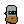

Let's regenerate with a zoom factor of 8x (8 times 24px = 192px)
to get the "original" inscribed size of 192×192px.
Type:


```
$ punk --offset=1 --zoom=8 gen  robot_male  big_beard
```

resulting in:

```
==> generating  >robot_male + big_beard<...
 lookup 24×24 >robotmale< => 69: Robot / Archetype - Robot (m+l)
 lookup 24×24 >bigbeard_(m+l)< => 387: Big Beard / Attribute (m+l)
    setting zoom to 8x
    saving punk #1 to >./punk-0001@8x.png<...
```

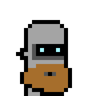


Voila!

Note:  The text-to-image generator uses space-separated
text prompts / attributes, that is,   change  "Male 2"  to `male_2` (or `male2`)
and "Bubble Gum" to `bubble_gum` (or `bubblegum`) and so on.
Let's try some more:

```
$ punk --offset=2 --zoom=8 gen  male_2  bubble_gum  birthday_hat
$ punk --offset=3 --zoom=8 gen  female_1  flowers  frown  gold_chain
$ punk --offset=4 --zoom=8 gen  demon_male  hoodie  pipe
$ punk --offset=5 --zoom=8 gen  ape_male_blue  buck_teeth  cowboy_hat
```

resulting in:

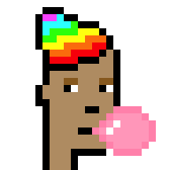
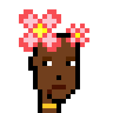
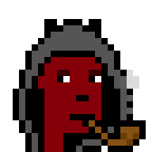
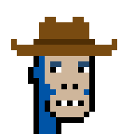


And so on.    Wondering what "magic" text-prompts / attributes
you can use?  Sorry, no artificial intelligence (a.i.) model
in use :-(  - you can lookup the "hard-coded" names
in the official punk spritesheet name list -
see [**spritesheet.csv**](https://github.com/cryptopunksnotdead/punks.spritesheet/blob/master/spritesheet.csv).


Tip of the Day - Did you know?
The punk text-to-image generator is part of the
[**Factory of Modern Originals (FoMO)**](https://github.com/profilepic/originals).

Let's retry with - bonus! - different backgrounds added in:

```
$ fab --name=punk1 --zoom=8 --background=ukraine  punk  robot_male  big_beard
$ fab --name=punk2 --zoom=8 --background=pride    punk  male_2  bubble_gum  birthday_hat
$ fab --name=punk3 --zoom=8 --background=matrix1  punk  female_1  flowers  frown  gold_chain
$ fab --name=punk4 --zoom=8 --background=0x638596 punk  demon_male  hoodie  pipe
$ fab --name=punk5 --zoom=8 --background=0xffbf00 punk  ape_male_blue  buck_teeth  cowboy_hat
```

resulting in:

```
==> welcome to the fab(ricate) tool:
 lookup 24×24 >robotmale< => 69: Robot / Archetype - Robot (m+l)
 lookup 24×24 >bigbeard_(m+l)< => 387: Big Beard / Attribute (m+l)
    saving original punk (192×192) to >./punk1@8x.png<...
 lookup 24×24 >male2< => 6: Human 2 / Archetype - Human (m+l)
 lookup 24×24 >bubblegum_(u+l)< => 376: Bubble Gum / Attribute (u+l)
 lookup 24×24 >birthdayhat_(u+l)< => 434: Birthday Hat / Attribute (u+l)
    saving original punk (192×192) to >./punk2@8x.png<...
 ...
```

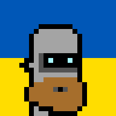
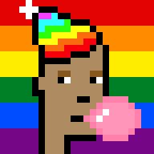
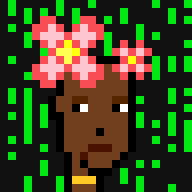
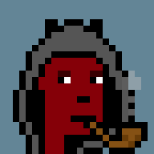
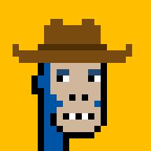


And so on.


##  Method №2  -  Using The Punk Image Script


Let's automate and use the punk machinery with a script.
Let's read in the 100 ordinal punk metadata records:

``` ruby
require 'punks'

recs = read_csv( "./ordinalpunks.csv" )
puts "    #{recs.size} record(s)"
#=> 100 record(s)
```


And let's wipe-up a `rec_to_attributes`
method that "transforms" a metadata record
such as

``` ruby
{"id"         =>"1",
 "type"       =>"Robot",
 "gender"     =>"Male",
 "skin_tone"  =>"",
 "count"      =>"1",
 "accessories"=>"Big Beard"}
# or
{"id"         =>"2",
 "type"       =>"Human",
 "gender"     =>"Male",
 "skin_tone"  =>"2",
 "count"      =>"2",
 "accessories"=>"Bubble Gum / Birthday Hat"}
```

into an array of strings / attributes ready for text-to-image generation
e.g.

``` ruby
["Robot Male", "Big Beard"]
# or
["Human Male 2", "Bubble Gum", "Birthday Hat"]
```


``` ruby
def rec_to_attributes( rec )
  type =     rec['type']
  gender =   rec['gender']
  skin_tone = rec['skin_tone']

  # note: merge type+gender+skin_tone into one attribute
  base = "#{type} #{gender}"
  base << " #{skin_tone}"       unless skin_tone.empty?

  accessories = rec['accessories'].split( '/' ).map { |acc| acc.strip }
  attributes = [base] + accessories
  attributes
end
```


And all-together now. Let's generate the 100 ordinal punk
images in 24×24 format and in 192×192 with 8x zoom:

``` ruby
recs.each do |rec|
  id  =      rec['id']
  puts "==> generating punk ##{id}..."

  attributes = rec_to_attributes( rec )
  pp attributes

  img = Punk::Image.generate( *attributes )
  img.save( "./tmp/#{id}.png")
  img.zoom(8).save( "./tmp/#{id}@8x.png")
end
```

Run the script - resulting in:

```
/1.png
 1@8x.png
 2.png
 2@8x.png
 ...
 100.png
 100@8x.png
```


 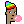  ...  


   ...  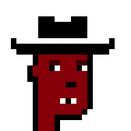


Bonus: Let's generate an all-in-one composite.
Change the loop to:


``` ruby
composite = ImageComposite.new( 10, 10, width: 24,
                                        height: 24 )

recs.each do |rec|
  id  =      rec['id']
  puts "==> generating punk ##{id}..."

  attributes = rec_to_attributes( rec )
  pp attributes

  img = Punk::Image.generate( *attributes )
  img.save( "./tmp/#{id}.png")
  img.zoom(8).save( "./tmp/#{id}@8x.png")


  composite << img    ## bonus: add to composite
end


## save all-in-one composite
composite.save( "./tmp/punks.png" )
composite.zoom(4).save( "./tmp/punks@2x.png" )
```

Rerun the script. Resulting in:


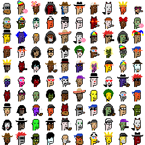

and the 4x version:


That's it.


## Questions? Comments?

Post them over at the [Help & Support](https://github.com/geraldb/help) page. Thanks.

